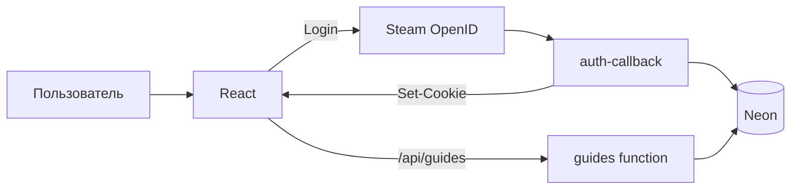

# Production: Steam-вход, профили и гайды

Рекомендуемая схема для ZabsEt на Netlify:

| Слой | Технология |
|------|------------|
| Фронт | React (Netlify) |
| API | Netlify Functions |
| База | PostgreSQL ([Neon](https://neon.tech)) |
| Вход | Steam OpenID + httpOnly cookie |

Отдельный Express-сервер (`server/`) **не нужен**, если всё настроено по этой инструкции.

---

## Быстрый старт (15 минут)

### 1. Neon — база данных

1. Создай проект на https://neon.tech  
2. **Postgres version:** выбери **16** или **18** — оба подходят; для Neon обычно берут **16** (стабильнее) или **18** (новее).  
3. **Neon Auth** — оставь **выключенным** (у нас вход через Steam, не Neon Auth).  
4. SQL Editor → вставь и выполни **`server/src/database/schema.sql`**  
5. Скопируй **Connection string** → это `DATABASE_URL`

### 2. Steam API Key

https://steamcommunity.com/dev/apikey  

**Domain** (Realm):
- `https://tf2zabset.netlify.app/`
- `http://localhost:8888` (для `npm run dev:netlify`)

### 3. Netlify → Environment variables

```
STEAM_API_KEY=...
SESSION_SECRET=...        # openssl rand -base64 32
DATABASE_URL=postgresql://...
```

**Deploy** → Redeploy site.

### 4. Локально

```bash
npm install
cp .env.example .env      # заполни STEAM_API_KEY, SESSION_SECRET, DATABASE_URL
npm run dev               # http://localhost:8888
```

**Важно:** не используй отдельно `npm run dev:vite` для входа через Steam — без Netlify Functions путь `/.netlify/functions/auth-callback` даст **404**.

В Steam API Key для локалки — домен **`localhost`**. Сайт: **http://localhost:8888**, вход через кнопку (функция `auth-steam-start`).

---

## Как это работает



- **Вход:** cookie `zabset_session` (7 дней), не `localStorage`.
- **Профиль:** Steam-данные + запись в `users`.
- **Гайды:** создаются в БД, привязаны к `user_id`, видны всем после `published = true`.
- **Рейтинг:** только для залогиненных.

---

## API (автоматически на Netlify)

| Метод | Путь | Описание |
|-------|------|----------|
| GET | `/api/guides` | Список опубликованных |
| GET | `/api/guides/:id` | Один гайд |
| POST | `/api/guides` | Создать (нужен вход) |
| PUT | `/api/guides/:id` | Редактировать (автор) |
| DELETE | `/api/guides/:id` | Удалить (автор) |
| POST | `/api/guides/:id/rate` | Оценка 1–5 |
| GET | `/api/guides/user/my-guides` | Мои гайды |

Auth:
- `/.netlify/functions/auth-callback` — Steam return
- `/.netlify/functions/auth-session` — текущий пользователь
- `/.netlify/functions/auth-logout` — выход

---

## Проверка после деплоя

1. Инкогнито → Profile → **Sign in with Steam**  
2. Аватар и ник отображаются  
3. Cookie `zabset_session` в DevTools  
4. Guides → **Create Guide** → опубликовать  
5. Другой браузер / друг — гайд виден в списке  

---

## Частые проблемы

| Проблема | Решение |
|----------|---------|
| 404 на `/.netlify/functions/auth-callback` | Запускай `npm run dev` (Netlify Dev), не `npm run dev:vite` |
| Steam: Invalid claimed_id or identity | В API Key добавь домен `localhost`; вход только с `http://localhost:8080` |
| «Database not configured» | Добавь `DATABASE_URL` в Netlify и redeploy |
| Гайд не создаётся | Войди заново после настройки БД (нужна запись в `users`) |
| 401 при создании гайда | Cookie заблокированы — проверь HTTPS и SameSite |

---

## Опционально: Express (`server/`)

Только если нужны TF2Center / logs.tf API из `server/`. Задай в Netlify:

```
VITE_API_BASE=https://твой-express-api.com
```

Иначе фронт использует только Netlify + Neon.
